00-Simulation_Hub
================
Compiled at 2023-10-25 12:44:01 UTC

# Simulations for Hub Graphs

## StARS Simulation (Liu et al. 2010)

- **Graph Structure:** The matrix rows/columns are partitioned into J
  equally-sized disjoint groups.
- **Groups:** Groups are denoted as V_1, V_2, …, V_J such that their
  union forms the set of all indices: V_1 U V_2 U … U V_J = {1, …, p}.
- **Pivotal Row:** Each of these groups V_k has an associated “pivotal”
  row denoted by k.
- **Size of Group:** The size of group V_1 is represented as s.
- **Omega (Precision Matrix) Structure:** For any index i in group V_k,
  the precision matrix elements Ω_ik and Ω_ki are set to value ρ. For
  any i not in V_k, the corresponding matrix elements are zero.
- **Experimental Details:** In Liu et al. (2010) the number of groups J
  is determined as J = floorfunct(p/s). The pivotal rows k are given by
  the sequence 1, s+1, 2s+1, …
- **Rho value:** The value of ρ is given as ρ = (1/(s+1)) and in this
  context, s = 20, thus ρ = 1/21.
- **Number of Hubs g:** We have groups of size s = 20 for p = 40,
  therefore g = J = floor(p/s) .
- **Hub size:** According to Liu et al. (2010) s = 20.
- **Off-Diagonal Elements of Precision Matrix v:** Represent the
  strength of the connections in the graph. v = ρ = (1/(s+1)) = 1/21.
- **Size of Subsampled Data Set:** According to Liu et al. (2010) b(n) =
  floor(10\*sqrt(n))
- **Diagonal Elements of Precision Matrix Ω i.e. u:** According to Liu
  et al. (2010), the values of the diagonal elements of Ω are set to be
  one. This means that the variances of each individual variable are set
  to one. Therefore u = 1.
- **Number of Edges E:** E_l = p - g
- **Sparsity Level:** Refers to the proportion of non-zero entries in
  the underlying true graphical model (i.e., the adjacency matrix or
  precision matrix). This gives an idea of how many edges (connections)
  are in the true graph compared to the total possible number of edges
  for a graph of that dimension.
- **Optimal Lambda:** Determines the amount of penalty applied during
  the graphical model estimation process. A higher lambda will result in
  a sparser estimated graph (with fewer edges), while a lower lambda
  will allow for more edges. The optimal lambda is determined based on
  the stability of the graph structure across multiple subsamples.
- **Threshold beta:** The beta threshold is a user-defined value that
  decides the minimum proportion necessary for an edge to be considered
  “stable” and thus be included in the final graph. For instance, if the
  threshold is set to 0.1, it means an edge should be present in at
  least 10% of the subsamples to be considered stable.
- **Adjacency Matrix:** An adjacency matrix is a square matrix used to
  represent a finite graph. The elements of the matrix indicate whether
  pairs of vertices are adjacent or not in the graph. For a simple graph
  (no self-loops or multiple edges) with vertex set V, the adjacency
  matrix A is a set of \|V\| x \|V\| where its element A_ij is 1 or
  non-negative, if there is an edge between vertix i and vertex j, and 0
  otherwise.

\##Simulate Synthetic Data \### 1) Hub Graph for n = 800 and p = 40

``` r
library(huge)
library(pulsar)

#Set Parameters
n <- 800 
p <- 40 
#Size of each hub group
s <- 20
#Number of hub groups
J <- floor(p/s) 
#Off-diagonal elements
rho <- (1/(s+1))
#Diagonal elements
u <- 0.0001


set.seed(123)
hub_s1 <- huge.generator(n = n, d = p, graph = "hub", v = rho, u = u, g = J, vis = TRUE)
```

    ## Generating data from the multivariate normal distribution with the hub graph structure....

<!-- -->

    ## done.

``` r
diag(hub_s1$omega)
```

    ##  [1] 1.835367 1.043967 1.043967 1.043967 1.043967 1.043967 1.043967 1.043967
    ##  [9] 1.043967 1.043967 1.043967 1.043967 1.043967 1.043967 1.043967 1.043967
    ## [17] 1.043967 1.043967 1.043967 1.043967 1.835367 1.043967 1.043967 1.043967
    ## [25] 1.043967 1.043967 1.043967 1.043967 1.043967 1.043967 1.043967 1.043967
    ## [33] 1.043967 1.043967 1.043967 1.043967 1.043967 1.043967 1.043967 1.043967

``` r
diag(hub_s1$sigma)
```

    ##  [1] 1 1 1 1 1 1 1 1 1 1 1 1 1 1 1 1 1 1 1 1 1 1 1 1 1 1 1 1 1 1 1 1 1 1 1 1 1 1
    ## [39] 1 1

``` r
hub_s1_data <- hub_s1$data

#Plot Adjacency Matrix
huge.plot(hub_s1$theta)
```

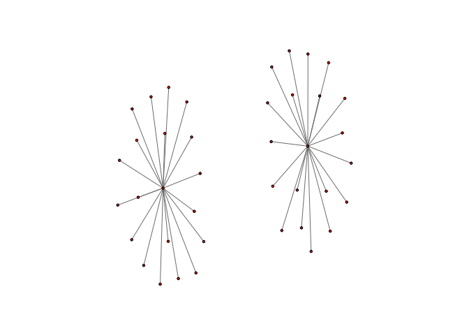<!-- -->

### 1.1) StARS for Hub Graph 1

``` r
#Subsampled dataset size 
b = (floor(10*sqrt(n)))/n

#Number of Subsamples N
N = 20

#Lambda path
lams_s1  <- getLamPath(max = getMaxCov(hub_s1_data), min = 0.01, len = 40)
hugeargs_s1 <- list(lambda=lams_s1, verbose=FALSE)

set.seed(123)
out.p_s1 <- pulsar(
      hub_s1_data,
      fun = huge::huge,
      fargs = hugeargs_s1,
      criterion = c("stars"),
      thresh = 0.1,
      subsample.ratio = b,
      rep.num = N,
      seed = NULL,
      lb.stars = FALSE,
      ub.stars = FALSE,
      ncores = 1,
      refit = FALSE
)

out.p_s1
```

    ## Mode: serial
    ## Path length: 40 
    ## Subsamples:  20 
    ## Graph dim:   40 
    ## Criterion:
    ##   stars... opt: index 22, lambda 0.141

``` r
plot(out.p_s1)
```

<!-- -->

``` r
lambda_opt_s1 <- opt.index(out.p_s1, criterion = "stars")
```

### 1.2) F1-Scores and Jaccard-Index for Hub1

``` r
# 1. Extract the estimated graph structure (estimated adjacency matrix)
fit_s1  <- refit(out.p_s1, criterion = "stars")
est_graph_s1 <- fit_s1[["refit"]][["stars"]]
huge.plot(est_graph_s1)
```

<!-- -->

``` r
# 2. Get the true graph structure (true adjacency matrix)
true_graph_s1 <- hub_s1$theta
huge.plot(true_graph_s1)
```

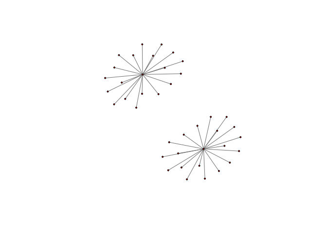<!-- -->

``` r
# 3. Compute the metrics
# Convert the matrices to binary (1 for edge, 0 for no edge)
est_bin_s1 <- as.numeric(est_graph_s1 != 0)
true_bin_s1 <- as.numeric(true_graph_s1 != 0)

# Compute true positives, false positives, true negatives, and false negatives
TP_s1 <- sum(est_bin_s1 == 1 & true_bin_s1 == 1)
FP_s1 <- sum(est_bin_s1 == 1 & true_bin_s1 == 0)
TN_s1 <- sum(est_bin_s1 == 0 & true_bin_s1 == 0)
FN_s1 <- sum(est_bin_s1 == 0 & true_bin_s1 == 1)

# Calculate precision, recall, F1-score (Sl. 8), and Jaccard index
precision_s1 <- TP_s1 / (TP_s1 + FP_s1)
recall_s1 <- TP_s1 / (TP_s1 + FN_s1)
F1_s1 <- 2 * (precision_s1 * recall_s1 / (precision_s1 + recall_s1))
jaccard_index_s1 <- TP_s1 / (TP_s1 + FP_s1 + FN_s1)

cat("F1-score:", F1_s1, "\n")
```

    ## F1-score: 0.9444444

``` r
cat("Jaccard Index:", jaccard_index_s1, "\n")
```

    ## Jaccard Index: 0.8947368

######################################### 

### 2) Hub Graph for n = 400 and p = 100

``` r
library(huge)
library(pulsar)

#Set Parameters
n <- 400 
p <- 100 
#Size of each hub group
s <- 20
#Number of hub groups
J <- floor(p/s) 
#Off-diagonal elements
rho <- (1/(s+1))
#Diagonal elements
u <- 0.0001


set.seed(123)
hub_s2 <- huge.generator(n = n, d = p, graph = "hub", v = rho, u = u, g = J, vis = TRUE)
```

    ## Generating data from the multivariate normal distribution with the hub graph structure....

<!-- -->

    ## done.

``` r
diag(hub_s2$omega)
```

    ##   [1] 1.835367 1.043967 1.043967 1.043967 1.043967 1.043967 1.043967 1.043967
    ##   [9] 1.043967 1.043967 1.043967 1.043967 1.043967 1.043967 1.043967 1.043967
    ##  [17] 1.043967 1.043967 1.043967 1.043967 1.835367 1.043967 1.043967 1.043967
    ##  [25] 1.043967 1.043967 1.043967 1.043967 1.043967 1.043967 1.043967 1.043967
    ##  [33] 1.043967 1.043967 1.043967 1.043967 1.043967 1.043967 1.043967 1.043967
    ##  [41] 1.835367 1.043967 1.043967 1.043967 1.043967 1.043967 1.043967 1.043967
    ##  [49] 1.043967 1.043967 1.043967 1.043967 1.043967 1.043967 1.043967 1.043967
    ##  [57] 1.043967 1.043967 1.043967 1.043967 1.835367 1.043967 1.043967 1.043967
    ##  [65] 1.043967 1.043967 1.043967 1.043967 1.043967 1.043967 1.043967 1.043967
    ##  [73] 1.043967 1.043967 1.043967 1.043967 1.043967 1.043967 1.043967 1.043967
    ##  [81] 1.835367 1.043967 1.043967 1.043967 1.043967 1.043967 1.043967 1.043967
    ##  [89] 1.043967 1.043967 1.043967 1.043967 1.043967 1.043967 1.043967 1.043967
    ##  [97] 1.043967 1.043967 1.043967 1.043967

``` r
diag(hub_s2$sigma)
```

    ##   [1] 1 1 1 1 1 1 1 1 1 1 1 1 1 1 1 1 1 1 1 1 1 1 1 1 1 1 1 1 1 1 1 1 1 1 1 1 1
    ##  [38] 1 1 1 1 1 1 1 1 1 1 1 1 1 1 1 1 1 1 1 1 1 1 1 1 1 1 1 1 1 1 1 1 1 1 1 1 1
    ##  [75] 1 1 1 1 1 1 1 1 1 1 1 1 1 1 1 1 1 1 1 1 1 1 1 1 1 1

``` r
hub_s2_data <- hub_s2$data

#Plot Adjacency Matrix
huge.plot(hub_s2$theta)
```

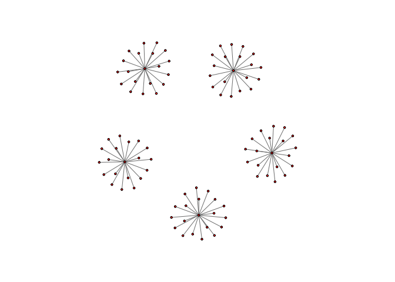<!-- -->

### 2.1) StARS for Hub Graph 2

``` r
#Subsampled dataset size 
b = (floor(10*sqrt(n)))/n

#Number of Subsamples N
N = 20

#Lambda path
lams_s2  <- getLamPath(max = getMaxCov(hub_s2_data), min = 0.01, len = 40)
hugeargs_s2 <- list(lambda=lams_s2, verbose=FALSE)

set.seed(123)
out.p_s2 <- pulsar(
      hub_s2_data,
      fun = huge::huge,
      fargs = hugeargs_s2,
      criterion = c("stars"),
      thresh = 0.1,
      subsample.ratio = b,
      rep.num = N,
      seed = NULL,
      lb.stars = FALSE,
      ub.stars = FALSE,
      ncores = 1,
      refit = FALSE
)

out.p_s2
```

    ## Mode: serial
    ## Path length: 40 
    ## Subsamples:  20 
    ## Graph dim:   100 
    ## Criterion:
    ##   stars... opt: index 23, lambda 0.161

``` r
plot(out.p_s2)
```

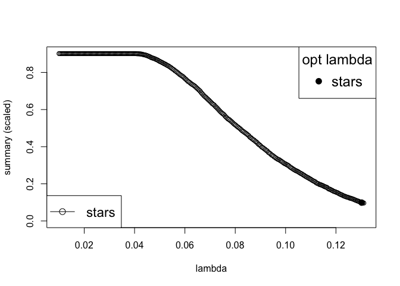<!-- -->

``` r
lambda_opt_s2 <- opt.index(out.p_s2, criterion = "stars")
```

### 2.2) F1-Scores and Jaccard-Index for Hub2

``` r
# 1. Extract the estimated graph structure (estimated adjacency matrix)
fit_s2  <- refit(out.p_s2, criterion = "stars")
est_graph_s2 <- fit_s2[["refit"]][["stars"]]
huge.plot(est_graph_s2)
```

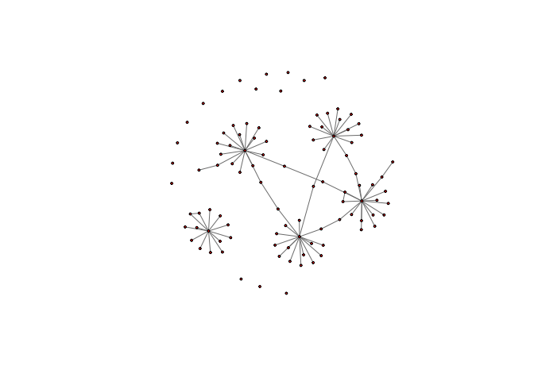<!-- -->

``` r
# 2. Get the true graph structure (true adjacency matrix)
true_graph_s2 <- hub_s2$theta
huge.plot(true_graph_s2)
```

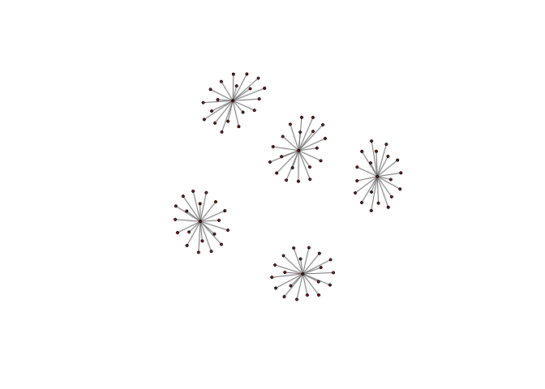<!-- -->

``` r
# 3. Compute the metrics
# Convert the matrices to binary (1 for edge, 0 for no edge)
est_bin_s2 <- as.numeric(est_graph_s2 != 0)
true_bin_s2 <- as.numeric(true_graph_s2 != 0)

# Compute true positives, false positives, true negatives, and false negatives
TP_s2 <- sum(est_bin_s2 == 1 & true_bin_s2 == 1)
FP_s2 <- sum(est_bin_s2 == 1 & true_bin_s2 == 0)
TN_s2 <- sum(est_bin_s2 == 0 & true_bin_s2 == 0)
FN_s2 <- sum(est_bin_s2 == 0 & true_bin_s2 == 1)

# Calculate precision, recall, F1-score (Sl. 8), and Jaccard index
precision_s2 <- TP_s2 / (TP_s2 + FP_s2)
recall_s2 <- TP_s2 / (TP_s2 + FN_s2)
F1_s2 <- 2 * (precision_s2 * recall_s2 / (precision_s2 + recall_s2))
jaccard_index_s2 <- TP_s2 / (TP_s2 + FP_s2 + FN_s2)

cat("F1-score:", F1_s2, "\n")
```

    ## F1-score: 0.8508287

``` r
cat("Jaccard Index:", jaccard_index_s2, "\n")
```

    ## Jaccard Index: 0.7403846

####################### 

### 3) Hub Graph for n = 200 and p = 100

``` r
library(huge)
library(pulsar)

#Set Parameters
n <- 200 
p <- 200 
#Size of each hub group
s <- 20
#Number of hub groups
J <- floor(p/s) 
#Off-diagonal elements
rho <- (1/(s+1))
#Diagonal elements
u <- 0.0001


set.seed(123)
hub_s3 <- huge.generator(n = n, d = p, graph = "hub", v = rho, u = u, g = J, vis = TRUE)
```

    ## Generating data from the multivariate normal distribution with the hub graph structure....

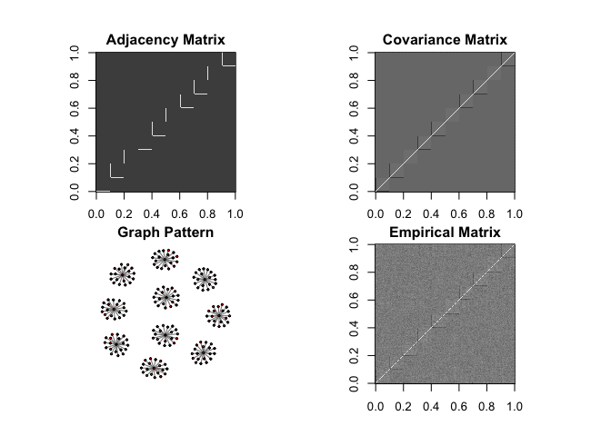<!-- -->

    ## done.

``` r
diag(hub_s3$omega)
```

    ##   [1] 1.835367 1.043967 1.043967 1.043967 1.043967 1.043967 1.043967 1.043967
    ##   [9] 1.043967 1.043967 1.043967 1.043967 1.043967 1.043967 1.043967 1.043967
    ##  [17] 1.043967 1.043967 1.043967 1.043967 1.835367 1.043967 1.043967 1.043967
    ##  [25] 1.043967 1.043967 1.043967 1.043967 1.043967 1.043967 1.043967 1.043967
    ##  [33] 1.043967 1.043967 1.043967 1.043967 1.043967 1.043967 1.043967 1.043967
    ##  [41] 1.835367 1.043967 1.043967 1.043967 1.043967 1.043967 1.043967 1.043967
    ##  [49] 1.043967 1.043967 1.043967 1.043967 1.043967 1.043967 1.043967 1.043967
    ##  [57] 1.043967 1.043967 1.043967 1.043967 1.835367 1.043967 1.043967 1.043967
    ##  [65] 1.043967 1.043967 1.043967 1.043967 1.043967 1.043967 1.043967 1.043967
    ##  [73] 1.043967 1.043967 1.043967 1.043967 1.043967 1.043967 1.043967 1.043967
    ##  [81] 1.835367 1.043967 1.043967 1.043967 1.043967 1.043967 1.043967 1.043967
    ##  [89] 1.043967 1.043967 1.043967 1.043967 1.043967 1.043967 1.043967 1.043967
    ##  [97] 1.043967 1.043967 1.043967 1.043967 1.835367 1.043967 1.043967 1.043967
    ## [105] 1.043967 1.043967 1.043967 1.043967 1.043967 1.043967 1.043967 1.043967
    ## [113] 1.043967 1.043967 1.043967 1.043967 1.043967 1.043967 1.043967 1.043967
    ## [121] 1.835367 1.043967 1.043967 1.043967 1.043967 1.043967 1.043967 1.043967
    ## [129] 1.043967 1.043967 1.043967 1.043967 1.043967 1.043967 1.043967 1.043967
    ## [137] 1.043967 1.043967 1.043967 1.043967 1.835367 1.043967 1.043967 1.043967
    ## [145] 1.043967 1.043967 1.043967 1.043967 1.043967 1.043967 1.043967 1.043967
    ## [153] 1.043967 1.043967 1.043967 1.043967 1.043967 1.043967 1.043967 1.043967
    ## [161] 1.835367 1.043967 1.043967 1.043967 1.043967 1.043967 1.043967 1.043967
    ## [169] 1.043967 1.043967 1.043967 1.043967 1.043967 1.043967 1.043967 1.043967
    ## [177] 1.043967 1.043967 1.043967 1.043967 1.835367 1.043967 1.043967 1.043967
    ## [185] 1.043967 1.043967 1.043967 1.043967 1.043967 1.043967 1.043967 1.043967
    ## [193] 1.043967 1.043967 1.043967 1.043967 1.043967 1.043967 1.043967 1.043967

``` r
diag(hub_s3$sigma)
```

    ##   [1] 1 1 1 1 1 1 1 1 1 1 1 1 1 1 1 1 1 1 1 1 1 1 1 1 1 1 1 1 1 1 1 1 1 1 1 1 1
    ##  [38] 1 1 1 1 1 1 1 1 1 1 1 1 1 1 1 1 1 1 1 1 1 1 1 1 1 1 1 1 1 1 1 1 1 1 1 1 1
    ##  [75] 1 1 1 1 1 1 1 1 1 1 1 1 1 1 1 1 1 1 1 1 1 1 1 1 1 1 1 1 1 1 1 1 1 1 1 1 1
    ## [112] 1 1 1 1 1 1 1 1 1 1 1 1 1 1 1 1 1 1 1 1 1 1 1 1 1 1 1 1 1 1 1 1 1 1 1 1 1
    ## [149] 1 1 1 1 1 1 1 1 1 1 1 1 1 1 1 1 1 1 1 1 1 1 1 1 1 1 1 1 1 1 1 1 1 1 1 1 1
    ## [186] 1 1 1 1 1 1 1 1 1 1 1 1 1 1 1

``` r
hub_s3_data <- hub_s3$data

#Plot Adjacency Matrix
huge.plot(hub_s3$theta)
```

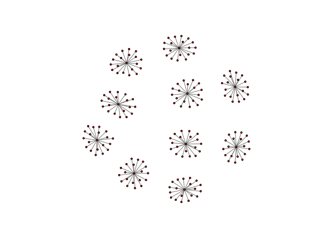<!-- -->

### 3.1) StARS for Hub Graph 3

``` r
#Subsampled dataset size 
b = (floor(10*sqrt(n)))/n

#Number of Subsamples N
N = 20

#Lambda path
lams_s3  <- getLamPath(max = getMaxCov(hub_s3_data), min = 0.01, len = 40)
hugeargs_s3 <- list(lambda=lams_s3, verbose=FALSE)

set.seed(123)
out.p_s3 <- pulsar(
      hub_s3_data,
      fun = huge::huge,
      fargs = hugeargs_s3,
      criterion = c("stars"),
      thresh = 0.1,
      subsample.ratio = b,
      rep.num = N,
      seed = NULL,
      lb.stars = FALSE,
      ub.stars = FALSE,
      ncores = 1,
      refit = FALSE
)

out.p_s3
```

    ## Mode: serial
    ## Path length: 40 
    ## Subsamples:  20 
    ## Graph dim:   200 
    ## Criterion:
    ##   stars... opt: index 25, lambda 0.173

``` r
plot(out.p_s3)
```

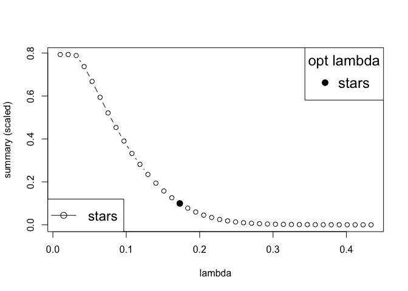<!-- -->

``` r
lambda_opt_s3 <- opt.index(out.p_s3, criterion = "stars")
```

### 3.2) F1-Scores and Jaccard-Index for Hub3

``` r
# 1. Extract the estimated graph structure (estimated adjacency matrix)
fit_s3  <- refit(out.p_s3, criterion = "stars")
est_graph_s3 <- fit_s3[["refit"]][["stars"]]
huge.plot(est_graph_s3)
```

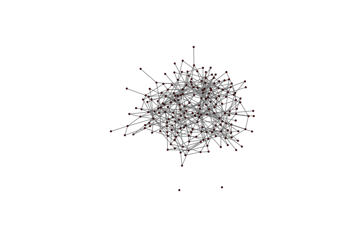<!-- -->

``` r
# 2. Get the true graph structure (true adjacency matrix)
true_graph_s3 <- hub_s3$theta
huge.plot(true_graph_s3)
```

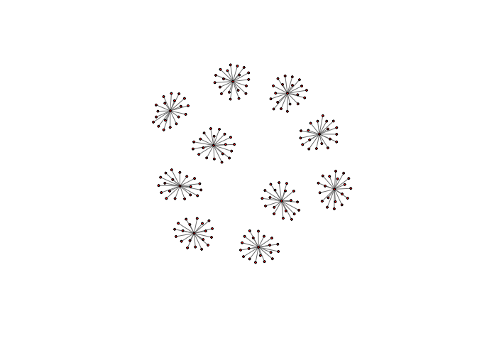<!-- -->

``` r
# 3. Compute the metrics
# Convert the matrices to binary (1 for edge, 0 for no edge)
est_bin_s3 <- as.numeric(est_graph_s3 != 0)
true_bin_s3 <- as.numeric(true_graph_s3 != 0)

# Compute true positives, false positives, true negatives, and false negatives
TP_s3 <- sum(est_bin_s3 == 1 & true_bin_s3 == 1)
FP_s3 <- sum(est_bin_s3 == 1 & true_bin_s3 == 0)
TN_s3 <- sum(est_bin_s3 == 0 & true_bin_s3 == 0)
FN_s3 <- sum(est_bin_s3 == 0 & true_bin_s3 == 1)

# Calculate precision, recall, F1-score (Sl. 8), and Jaccard index
precision_s3 <- TP_s3 / (TP_s3 + FP_s3)
recall_s3 <- TP_s3 / (TP_s3 + FN_s3)
F1_s3 <- 2 * (precision_s3 * recall_s3 / (precision_s3 + recall_s3))
jaccard_index_s3 <- TP_s3 / (TP_s3 + FP_s3 + FN_s3)

cat("F1-score:", F1_s3, "\n")
```

    ## F1-score: 0.4193012

``` r
cat("Jaccard Index:", jaccard_index_s3, "\n")
```

    ## Jaccard Index: 0.2652632

################# 

### 4) Hub Graph for n = 100 and p = 400

``` r
library(huge)
library(pulsar)

#Set Parameters
n <- 100 
p <- 400 
#Size of each hub group
s <- 20
#Number of hub groups
J <- floor(p/s) 
#Off-diagonal elements
rho <- (1/(s+1))
#Diagonal elements
u <- 0.0001


set.seed(123)
hub_s4 <- huge.generator(n = n, d = p, graph = "hub", v = rho, u = u, g = J, vis = TRUE)
```

    ## Generating data from the multivariate normal distribution with the hub graph structure....

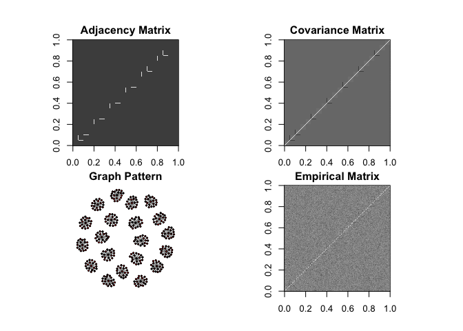<!-- -->

    ## done.

``` r
diag(hub_s4$omega)
```

    ##   [1] 1.835367 1.043967 1.043967 1.043967 1.043967 1.043967 1.043967 1.043967
    ##   [9] 1.043967 1.043967 1.043967 1.043967 1.043967 1.043967 1.043967 1.043967
    ##  [17] 1.043967 1.043967 1.043967 1.043967 1.835367 1.043967 1.043967 1.043967
    ##  [25] 1.043967 1.043967 1.043967 1.043967 1.043967 1.043967 1.043967 1.043967
    ##  [33] 1.043967 1.043967 1.043967 1.043967 1.043967 1.043967 1.043967 1.043967
    ##  [41] 1.835367 1.043967 1.043967 1.043967 1.043967 1.043967 1.043967 1.043967
    ##  [49] 1.043967 1.043967 1.043967 1.043967 1.043967 1.043967 1.043967 1.043967
    ##  [57] 1.043967 1.043967 1.043967 1.043967 1.835367 1.043967 1.043967 1.043967
    ##  [65] 1.043967 1.043967 1.043967 1.043967 1.043967 1.043967 1.043967 1.043967
    ##  [73] 1.043967 1.043967 1.043967 1.043967 1.043967 1.043967 1.043967 1.043967
    ##  [81] 1.835367 1.043967 1.043967 1.043967 1.043967 1.043967 1.043967 1.043967
    ##  [89] 1.043967 1.043967 1.043967 1.043967 1.043967 1.043967 1.043967 1.043967
    ##  [97] 1.043967 1.043967 1.043967 1.043967 1.835367 1.043967 1.043967 1.043967
    ## [105] 1.043967 1.043967 1.043967 1.043967 1.043967 1.043967 1.043967 1.043967
    ## [113] 1.043967 1.043967 1.043967 1.043967 1.043967 1.043967 1.043967 1.043967
    ## [121] 1.835367 1.043967 1.043967 1.043967 1.043967 1.043967 1.043967 1.043967
    ## [129] 1.043967 1.043967 1.043967 1.043967 1.043967 1.043967 1.043967 1.043967
    ## [137] 1.043967 1.043967 1.043967 1.043967 1.835367 1.043967 1.043967 1.043967
    ## [145] 1.043967 1.043967 1.043967 1.043967 1.043967 1.043967 1.043967 1.043967
    ## [153] 1.043967 1.043967 1.043967 1.043967 1.043967 1.043967 1.043967 1.043967
    ## [161] 1.835367 1.043967 1.043967 1.043967 1.043967 1.043967 1.043967 1.043967
    ## [169] 1.043967 1.043967 1.043967 1.043967 1.043967 1.043967 1.043967 1.043967
    ## [177] 1.043967 1.043967 1.043967 1.043967 1.835367 1.043967 1.043967 1.043967
    ## [185] 1.043967 1.043967 1.043967 1.043967 1.043967 1.043967 1.043967 1.043967
    ## [193] 1.043967 1.043967 1.043967 1.043967 1.043967 1.043967 1.043967 1.043967
    ## [201] 1.835367 1.043967 1.043967 1.043967 1.043967 1.043967 1.043967 1.043967
    ## [209] 1.043967 1.043967 1.043967 1.043967 1.043967 1.043967 1.043967 1.043967
    ## [217] 1.043967 1.043967 1.043967 1.043967 1.835367 1.043967 1.043967 1.043967
    ## [225] 1.043967 1.043967 1.043967 1.043967 1.043967 1.043967 1.043967 1.043967
    ## [233] 1.043967 1.043967 1.043967 1.043967 1.043967 1.043967 1.043967 1.043967
    ## [241] 1.835367 1.043967 1.043967 1.043967 1.043967 1.043967 1.043967 1.043967
    ## [249] 1.043967 1.043967 1.043967 1.043967 1.043967 1.043967 1.043967 1.043967
    ## [257] 1.043967 1.043967 1.043967 1.043967 1.835367 1.043967 1.043967 1.043967
    ## [265] 1.043967 1.043967 1.043967 1.043967 1.043967 1.043967 1.043967 1.043967
    ## [273] 1.043967 1.043967 1.043967 1.043967 1.043967 1.043967 1.043967 1.043967
    ## [281] 1.835367 1.043967 1.043967 1.043967 1.043967 1.043967 1.043967 1.043967
    ## [289] 1.043967 1.043967 1.043967 1.043967 1.043967 1.043967 1.043967 1.043967
    ## [297] 1.043967 1.043967 1.043967 1.043967 1.835367 1.043967 1.043967 1.043967
    ## [305] 1.043967 1.043967 1.043967 1.043967 1.043967 1.043967 1.043967 1.043967
    ## [313] 1.043967 1.043967 1.043967 1.043967 1.043967 1.043967 1.043967 1.043967
    ## [321] 1.835367 1.043967 1.043967 1.043967 1.043967 1.043967 1.043967 1.043967
    ## [329] 1.043967 1.043967 1.043967 1.043967 1.043967 1.043967 1.043967 1.043967
    ## [337] 1.043967 1.043967 1.043967 1.043967 1.835367 1.043967 1.043967 1.043967
    ## [345] 1.043967 1.043967 1.043967 1.043967 1.043967 1.043967 1.043967 1.043967
    ## [353] 1.043967 1.043967 1.043967 1.043967 1.043967 1.043967 1.043967 1.043967
    ## [361] 1.835367 1.043967 1.043967 1.043967 1.043967 1.043967 1.043967 1.043967
    ## [369] 1.043967 1.043967 1.043967 1.043967 1.043967 1.043967 1.043967 1.043967
    ## [377] 1.043967 1.043967 1.043967 1.043967 1.835367 1.043967 1.043967 1.043967
    ## [385] 1.043967 1.043967 1.043967 1.043967 1.043967 1.043967 1.043967 1.043967
    ## [393] 1.043967 1.043967 1.043967 1.043967 1.043967 1.043967 1.043967 1.043967

``` r
diag(hub_s4$sigma)
```

    ##   [1] 1 1 1 1 1 1 1 1 1 1 1 1 1 1 1 1 1 1 1 1 1 1 1 1 1 1 1 1 1 1 1 1 1 1 1 1 1
    ##  [38] 1 1 1 1 1 1 1 1 1 1 1 1 1 1 1 1 1 1 1 1 1 1 1 1 1 1 1 1 1 1 1 1 1 1 1 1 1
    ##  [75] 1 1 1 1 1 1 1 1 1 1 1 1 1 1 1 1 1 1 1 1 1 1 1 1 1 1 1 1 1 1 1 1 1 1 1 1 1
    ## [112] 1 1 1 1 1 1 1 1 1 1 1 1 1 1 1 1 1 1 1 1 1 1 1 1 1 1 1 1 1 1 1 1 1 1 1 1 1
    ## [149] 1 1 1 1 1 1 1 1 1 1 1 1 1 1 1 1 1 1 1 1 1 1 1 1 1 1 1 1 1 1 1 1 1 1 1 1 1
    ## [186] 1 1 1 1 1 1 1 1 1 1 1 1 1 1 1 1 1 1 1 1 1 1 1 1 1 1 1 1 1 1 1 1 1 1 1 1 1
    ## [223] 1 1 1 1 1 1 1 1 1 1 1 1 1 1 1 1 1 1 1 1 1 1 1 1 1 1 1 1 1 1 1 1 1 1 1 1 1
    ## [260] 1 1 1 1 1 1 1 1 1 1 1 1 1 1 1 1 1 1 1 1 1 1 1 1 1 1 1 1 1 1 1 1 1 1 1 1 1
    ## [297] 1 1 1 1 1 1 1 1 1 1 1 1 1 1 1 1 1 1 1 1 1 1 1 1 1 1 1 1 1 1 1 1 1 1 1 1 1
    ## [334] 1 1 1 1 1 1 1 1 1 1 1 1 1 1 1 1 1 1 1 1 1 1 1 1 1 1 1 1 1 1 1 1 1 1 1 1 1
    ## [371] 1 1 1 1 1 1 1 1 1 1 1 1 1 1 1 1 1 1 1 1 1 1 1 1 1 1 1 1 1 1

``` r
hub_s4_data <- hub_s4$data

#Plot Adjacency Matrix
huge.plot(hub_s4$theta)
```

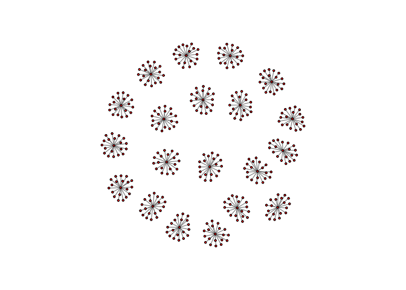<!-- -->

### 4.1) StARS for Hub Graph 4

``` r
#Subsampled dataset size 
b = (floor(10*sqrt(n)))/n

#Number of Subsamples N
N = 20

#Lambda path
lams_s4  <- getLamPath(max = getMaxCov(hub_s4_data), min = 0.01, len = 40)
hugeargs_s4 <- list(lambda=lams_s4, verbose=FALSE)

set.seed(123)
out.p_s4 <- pulsar(
      hub_s4_data,
      fun = huge::huge,
      fargs = hugeargs_s4,
      criterion = c("stars"),
      thresh = 0.1,
      subsample.ratio = b,
      rep.num = N,
      seed = NULL,
      lb.stars = FALSE,
      ub.stars = FALSE,
      ncores = 1,
      refit = FALSE
)
```

    ## Warning in .starsind(est$summary, stars.thresh): Optimal lambda may be outside
    ## the supplied values

``` r
out.p_s4
```

    ## Mode: serial
    ## Path length: 40 
    ## Subsamples:  20 
    ## Graph dim:   400 
    ## Criterion:
    ##   stars... opt: index 40, lambda 0.01

``` r
plot(out.p_s4)
```

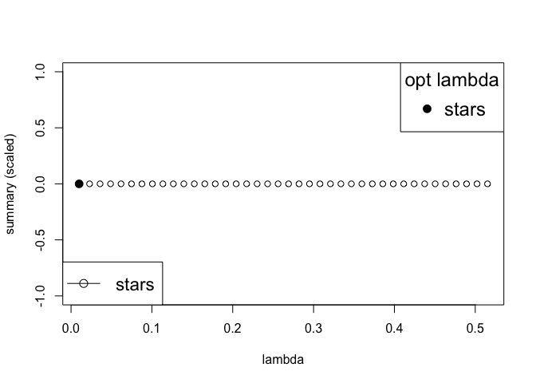<!-- -->

``` r
lambda_opt_s4 <- opt.index(out.p_s4, criterion = "stars")
```

### 4.2) F1-Scores and Jaccard-Index for Hub4

``` r
# 1. Extract the estimated graph structure (estimated adjacency matrix)
fit_s4  <- refit(out.p_s4, criterion = "stars")
est_graph_s4 <- fit_s4[["refit"]][["stars"]]
huge.plot(est_graph_s4)
```

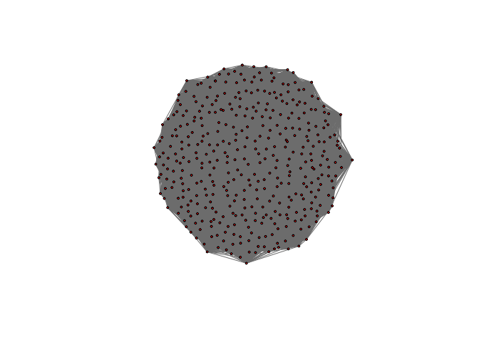<!-- -->

``` r
# 2. Get the true graph structure (true adjacency matrix)
true_graph_s4 <- hub_s4$theta
huge.plot(true_graph_s4)
```

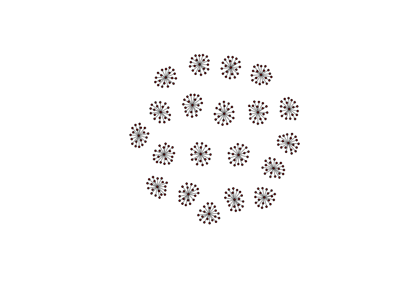<!-- -->

``` r
# 3. Compute the metrics
# Convert the matrices to binary (1 for edge, 0 for no edge)
est_bin_s4 <- as.numeric(est_graph_s4 != 0)
true_bin_s4 <- as.numeric(true_graph_s4 != 0)

# Compute true positives, false positives, true negatives, and false negatives
TP_s4 <- sum(est_bin_s4 == 1 & true_bin_s4 == 1)
FP_s4 <- sum(est_bin_s4 == 1 & true_bin_s4 == 0)
TN_s4 <- sum(est_bin_s4 == 0 & true_bin_s4 == 0)
FN_s4 <- sum(est_bin_s4 == 0 & true_bin_s4 == 1)

# Calculate precision, recall, F1-score (Sl. 8), and Jaccard index
precision_s4 <- TP_s4 / (TP_s4 + FP_s4)
recall_s4 <- TP_s4 / (TP_s4 + FN_s4)
F1_s4 <- 2 * (precision_s4 * recall_s4 / (precision_s4 + recall_s4))
jaccard_index_s4 <- TP_s4 / (TP_s4 + FP_s4 + FN_s4)

cat("F1-score:", F1_s4, "\n")
```

    ## F1-score: 0.01932048

``` r
cat("Jaccard Index:", jaccard_index_s4, "\n")
```

    ## Jaccard Index: 0.009754469

### Session info

``` r
sessionInfo()
```

    ## R version 4.3.1 (2023-06-16)
    ## Platform: x86_64-apple-darwin20 (64-bit)
    ## Running under: macOS Sonoma 14.0
    ## 
    ## Matrix products: default
    ## BLAS:   /Library/Frameworks/R.framework/Versions/4.3-x86_64/Resources/lib/libRblas.0.dylib 
    ## LAPACK: /Library/Frameworks/R.framework/Versions/4.3-x86_64/Resources/lib/libRlapack.dylib;  LAPACK version 3.11.0
    ## 
    ## locale:
    ## [1] en_US.UTF-8/en_US.UTF-8/en_US.UTF-8/C/en_US.UTF-8/en_US.UTF-8
    ## 
    ## time zone: Europe/Paris
    ## tzcode source: internal
    ## 
    ## attached base packages:
    ## [1] stats     graphics  grDevices utils     datasets  methods   base     
    ## 
    ## other attached packages:
    ## [1] pulsar_0.3.11 huge_1.3.5   
    ## 
    ## loaded via a namespace (and not attached):
    ##  [1] igraph_1.5.1      digest_0.6.33     fastmap_1.1.1     xfun_0.40        
    ##  [5] Matrix_1.5-4.1    lattice_0.21-8    magrittr_2.0.3    parallel_4.3.1   
    ##  [9] knitr_1.44        pkgconfig_2.0.3   htmltools_0.5.6.1 rmarkdown_2.25   
    ## [13] cli_3.6.1         grid_4.3.1        compiler_4.3.1    rstudioapi_0.15.0
    ## [17] tools_4.3.1       evaluate_0.22     Rcpp_1.0.11       yaml_2.3.7       
    ## [21] rlang_1.1.1       MASS_7.3-60
