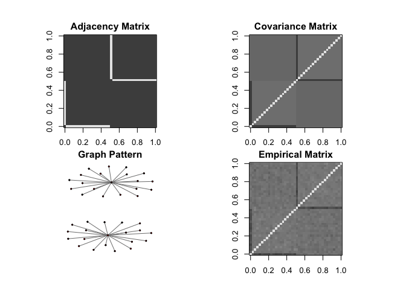
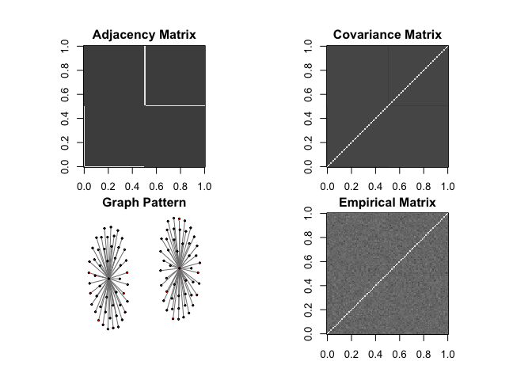
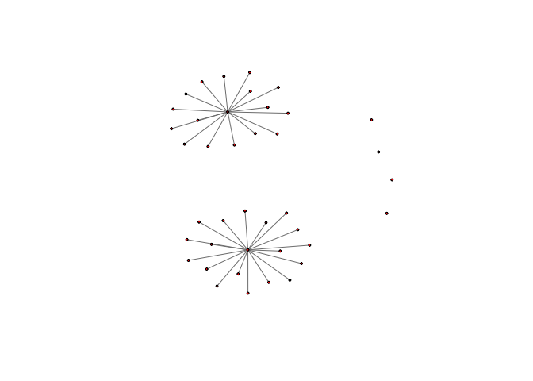
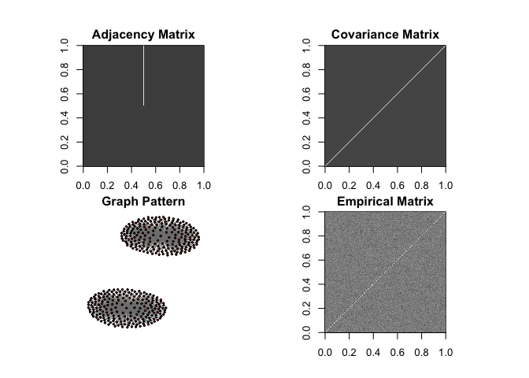

00-Simulation_Hub
================
Compiled at 2023-10-22 12:53:39 UTC

# Simulations for Hub Graphs

## StARS Simulation (Liu et al. 2010)

- **Graph Structure:** The matrix rows/columns are partitioned into J
  equally-sized disjoint groups.
- **Groups:** Groups are denoted as V_1, V_2, …, V_J such that their
  union forms the set of all indices: V_1 U V_2 U … U V_J = {1, …, p}.
- **Pivotal Row:** Each of these groups V_k has an associated “pivotal”
  row denoted by k.
- **Size of Group:** The size of group V_1 is represented as s.
- **Omega (Precision Matrix) Structure:** For any index i in group V_k,
  the precision matrix elements Ω_ik and Ω_ki are set to value ρ. For
  any i not in V_k, the corresponding matrix elements are zero.
- **Experimental Details:** In Liu et al. (2010) the number of groups J
  is determined as J = floorfunct(p/s). The pivotal rows k are given by
  the sequence 1, s+1, 2s+1, …
- **Rho value:** The value of ρ is given as ρ = (1/(s+1)) and in this
  context, s = 20, thus ρ = 1/21.
- **Number of Hubs g:** We have groups of size s = 20 for p = 40,
  therefore g = J = floor(p/s) = 2.
- **Hub size:** According to Liu et al. (2010) s = 20.
- **Off-Diagonal Elements of Precision Matrix v:** Represent the
  strength of the connections in the graph. v = ρ = (1/(s+1)) = 1/21.
- **Size of Subsampled Data Set:** According to Liu et al. (2010) b(n) =
  floor(10\*sqrt(n))
- **Diagonal Elements of Precision Matrix Ω i.e. u:** According to Liu
  et al. (2010), the values of the diagonal elements of Ω are set to be
  one. This means that the variances of each individual variable are set
  to one. Therefore u = 1.
- **Number of Edges E:** E_l = p - g

## 1) Simulation for n = 800 and p = 40

``` r
library(huge)
library(pulsar)

#Set Parameters
n <- 800 ; p <- 40 ; s <-  20
v <-  (1/(s+1)) ; u <-  1 ; g <-  2 ; b = floor(10*sqrt(n))

hub1 <- huge.generator(n, p, graph = "hub", v, u, g, vis = TRUE)
```

    ## Generating data from the multivariate normal distribution with the hub graph structure....

<!-- -->

    ## done.

## 2) Simulation for n = 400 and p = 100

``` r
library(huge)
library(pulsar)

#Set Parameters
n <- 400 ; p <- 100 ; s <-  20
v <-  (1/(s+1)) ; u <-  1 ; g <-  2 ; b = floor(10*sqrt(n))

hub2 <- huge.generator(n, p, graph = "hub", v, u, g, vis = TRUE)
```

    ## Generating data from the multivariate normal distribution with the hub graph structure....

<!-- -->

    ## done.

## 3) Simulation for n = 200 and p = 200

``` r
library(huge)
library(pulsar)

#Set Parameters
n <- 200 ; p <- 200 ; s <-  20
v <-  (1/(s+1)) ; u <-  1 ; g <-  2 ; b = floor(10*sqrt(n))

hub3 <- huge.generator(n, p, graph = "hub", v, u, g, vis = TRUE)
```

    ## Generating data from the multivariate normal distribution with the hub graph structure....

<!-- -->

    ## done.

## 4) Simulation for n = 100 and p = 400

``` r
library(huge)
library(pulsar)

#Set Parameters
n <- 100 ; p <- 400 ; s <-  20
v <-  (1/(s+1)) ; u <-  1 ; g <-  2 ; b = floor(10*sqrt(n))

hub4 <- huge.generator(n, p, graph = "hub", v, u, g, vis = TRUE)
```

    ## Generating data from the multivariate normal distribution with the hub graph structure....

<!-- -->

    ## done.

### Session info

``` r
sessionInfo()
```

    ## R version 4.3.1 (2023-06-16)
    ## Platform: x86_64-apple-darwin20 (64-bit)
    ## Running under: macOS Sonoma 14.0
    ## 
    ## Matrix products: default
    ## BLAS:   /Library/Frameworks/R.framework/Versions/4.3-x86_64/Resources/lib/libRblas.0.dylib 
    ## LAPACK: /Library/Frameworks/R.framework/Versions/4.3-x86_64/Resources/lib/libRlapack.dylib;  LAPACK version 3.11.0
    ## 
    ## locale:
    ## [1] en_US.UTF-8/en_US.UTF-8/en_US.UTF-8/C/en_US.UTF-8/en_US.UTF-8
    ## 
    ## time zone: Europe/Paris
    ## tzcode source: internal
    ## 
    ## attached base packages:
    ## [1] stats     graphics  grDevices utils     datasets  methods   base     
    ## 
    ## other attached packages:
    ## [1] pulsar_0.3.11 huge_1.3.5   
    ## 
    ## loaded via a namespace (and not attached):
    ##  [1] igraph_1.5.1      digest_0.6.33     fastmap_1.1.1     xfun_0.40        
    ##  [5] Matrix_1.5-4.1    lattice_0.21-8    magrittr_2.0.3    parallel_4.3.1   
    ##  [9] knitr_1.44        pkgconfig_2.0.3   htmltools_0.5.6.1 rmarkdown_2.25   
    ## [13] cli_3.6.1         grid_4.3.1        compiler_4.3.1    rstudioapi_0.15.0
    ## [17] tools_4.3.1       evaluate_0.22     Rcpp_1.0.11       yaml_2.3.7       
    ## [21] rlang_1.1.1       MASS_7.3-60
